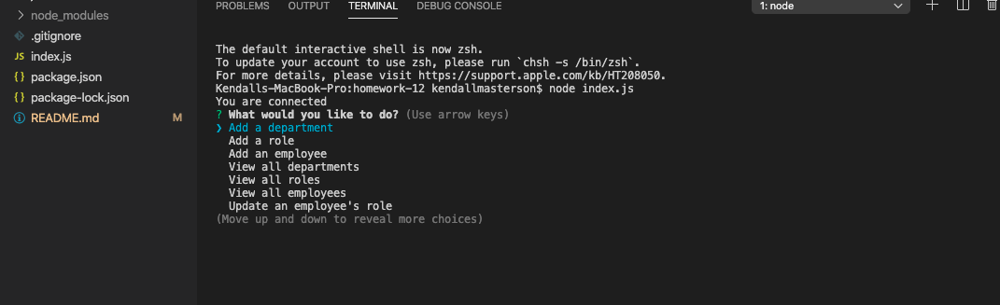
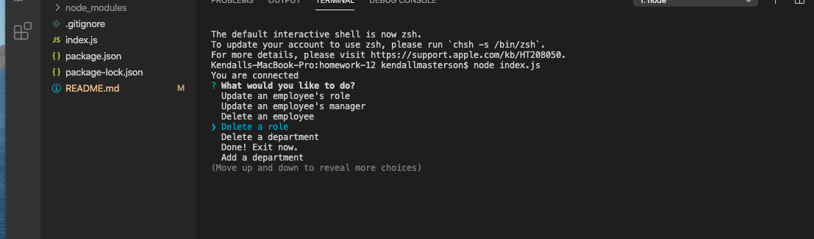

# employeeManagement

<h2> Employee Management System </h2> 

<h2> Author </h2>

Kendall Masterson

https://github.com/mastersonkl

masterson.kendall@gmail.com

<h2> Description </h2>

This project is a CLI app that will help an employer keep track of employees positions, managers, roles, departments and salary. You can edit, delete, and add to the system as your company changes. 

**## Table of Contents**

- [Installation Instructions](#installation-instructions)
- [Usage Information](#usage-information)

## Installation Instructions

You can install this program by cloning it to your local machine by running `git clone`. Run `npm i` to install the dependencies included in the package.json. After you successfully clone it to your local machine, you can copy the data in the db folder over to your own MySQLWorkbench on your local machine. 

## Usage Information

After installing the program, run it in your terminal using node `node index.js`. The program will then initialize and will begin to prompt you with many options about what you can do next. You can see all the options by using the up and down arrow keys on your keyboard. Please look at both of the pictures below to see all the options or watch my demo video below. 

Here is a link to my demo: https://drive.google.com/file/d/1XcwtMae4s-PMMpC_xnWltKccMaUrmW0Q/view?usp=sharing

